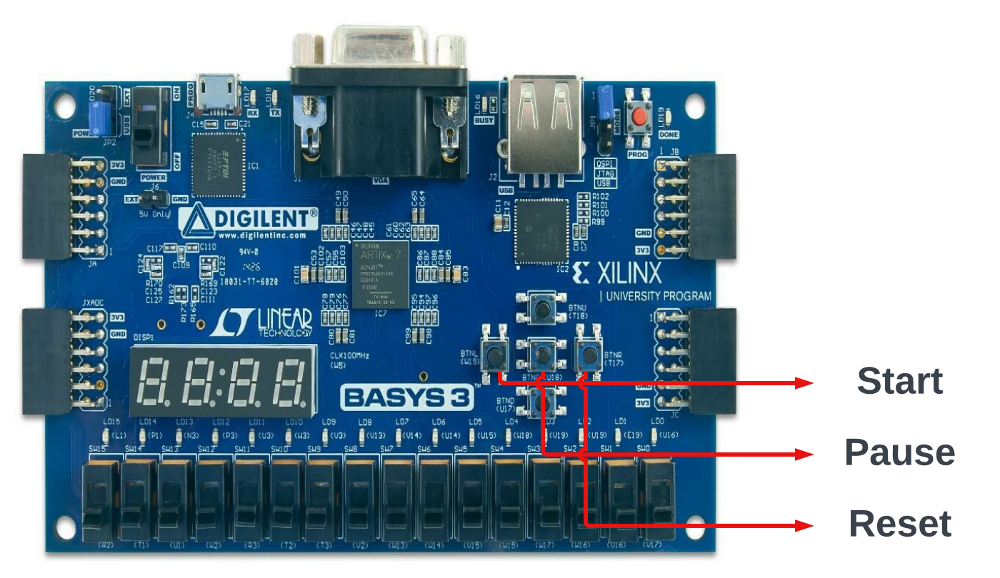
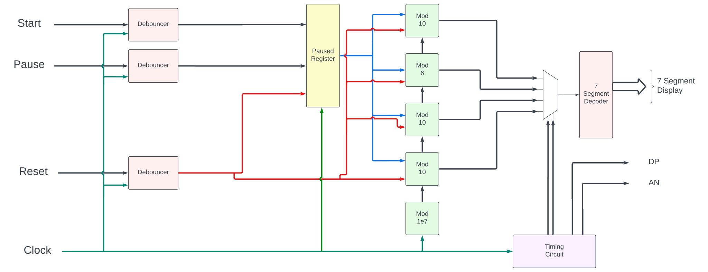

# Stopwach on Basys-3

For the stopwatch, the following modules were developed - 
* Debouncer (smooth.vhd)
* Generic Modulo counter (mod.vhd)
* Timing Circuit (tim_cir.vhd)
* Multiplexer (mux.vhd)
* Seven segment decoder (7_seg_decoder.vhd)
* Glue + Pause logic (glue.vhd)

## Controls

## Block Diagram

## Logic and Brief Explanation of Design
### Debouncer

The debouncing logic used is based on a counter. The main idea is to check whether the button under consideration is pressed for a long enough time. For this purpose we use a counter which counts every time the internal clock of the Basys board ticks and the button is pressed. If the button stops being pressed before the counter reaches a threshold value ($10^6$/10ms in our case), it is not considered as being pressed for long enough.

### Pause Logic
The left button on the board corresponds to 'start', the centre button corresponds to 'pause', and the right button corresponds to 'reset'. When the start button is pressed, the stopwatch starts working and can be paused using the pause button. The reset button resets the timer to zero as well as pauses it. After pausing or resetting, the start button is required to restart the stopwatch. This is implemented in 'glue.vhd'.

### Modulo Counters and Clocks
The given $10^8$ Hertz clock's frequency was divided by using a combination of modulo counters chained together. The modulo counter uses a generic so that we can implement the modulo counters for 10,6,1e7 without code duplication. The main clock was first used to create a 0.1-second clock using the modulo $10^7$ counter. The 0.1-second clock was used as the input to a modulo 10 counter to create a 1-second counter and similarly 10 second and 1-minute clocks using modulo 6 and modulo 10 were designed.

To implement the pause and reset logic, once the pause or the reset button is pressed, a register(*is_paused* in our implementation) used to store the current state of the stopwatch gets turned to 1. While it's 1, we do not increment the modulo counters on the rising edge. Additionally, when the reset button is pressed, the modulo counters reset to 0. When the start button is pressed, the *is_paused* register changes to 1 and the modulo counters start working normally and incrementing based on rising edge of the clock.

### Timing Circuit
The timing circuit controls the anode, decimal point and select signals (to the multiplexer). It takes the original clock as an input and using an internal tally changes the select bits every $2\times 10^5$ cycles of the clock. This gives a refresh rate in the desired range of between 1 and 16 milliseconds and prevents the displays from flickering.
### Multiplexer
The multiplexer simply takes 4 inputs from the chained clocks and, depending on the select bits, chooses one to pass to the seven-segment decoder. 
### Seven Segment Decoder
The seven-segment decoder using combinational logic figures out which cathodes to set to LOW or HIGH depending on the input digit. The logic was designed using Karnaugh map minimization.